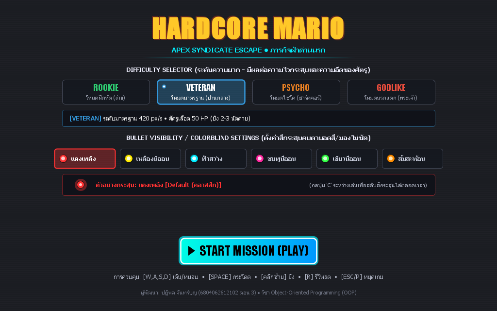
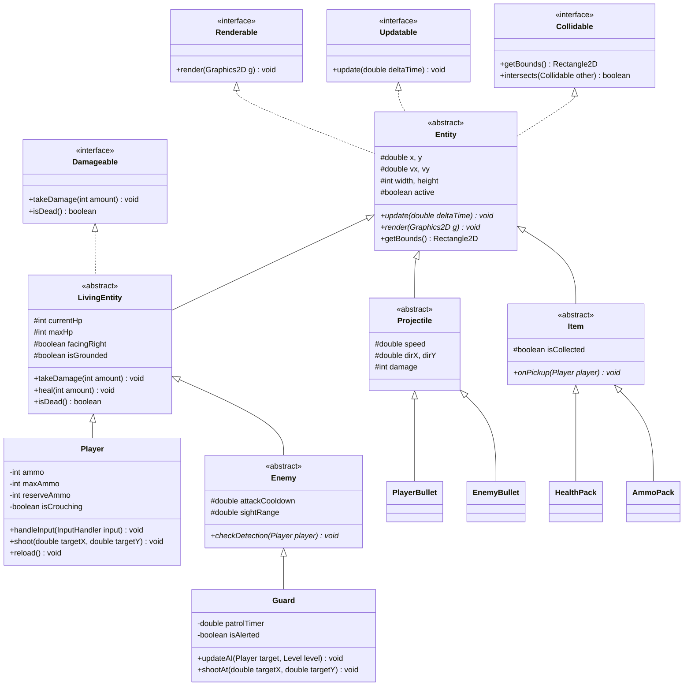

# 🍄 Hardcore Mario (มาริโอ้เถื่อน) 💥

<div align="center">

[](https://github.com/jackpatipon/hardcore_mario/releases/latest)
[-blue?style=for-the-badge&logo=windows)](https://github.com/jackpatipon/hardcore_mario/releases/latest)


<br><br>

<a href="https://github.com/jackpatipon/hardcore_mario/releases/latest">
  
</a>

<p align="center">
  <br>
  <a href="https://github.com/jackpatipon/hardcore_mario/releases/latest">
    <b>👉 📥 [คลิกที่นี่เพื่อดาวน์โหลดเกมเวอร์ชันล่าสุด v1.0.0 ไปเล่นได้ทันที] 👈</b>
  </a>
</p>

<p align="center">
  <b>2D Side-Scrolling Action Platformer ผสมผสานสไตล์ Metal Slug + Mario</b><br>
  <i>"เมื่อโลกเห็ดไม่ใช่ความจริง... สู่มหากาพย์การแหกแล็บสุดดิบเถื่อนของหนูทดลองรหัส 6804062612102"</i>
</p>

</div>

---

## 📥 วิธีดาวน์โหลดและเริ่มเล่นทันที (Download & Play)

ไม่ต้องติดตั้งโปรแกรมเขียนโค้ด ไม่ต้องมี VS Code เพียงดาวน์โหลดตัวเกมสำเร็จรูป:

1. กดเข้าไปที่หน้าดาวน์โหลด: **[GitHub Releases ล่าสุด](https://github.com/jackpatipon/hardcore_mario/releases/latest)**
2. คลิกดาวน์โหลดไฟล์ **`HardcoreMario_v1.0.zip`** (หรือไฟล์ **`HardcoreMario.jar`**)
3. คลิกขวาที่ไฟล์ ZIP เลือก **Extract All... (แตกไฟล์)**
4. **ดับเบิลคลิกที่ไฟล์ `HardcoreMario.jar`** เพื่อเข้าสู่เกมได้ทันที!
   *(เครื่องต้องมี Java Runtime / JRE 8 ขึ้นไป)*

---

## 📖 เนื้อเรื่องย่อ (Lore)

หลังจากจบศึกช่วยเจ้าหญิง มาริโอ้ตื่นขึ้นมาพบความจริงอันโหดร้ายว่า **โลกเห็ดอันสงบสุขเป็นเพียงแค่ Simulation เสมือนจริง** เพื่อทดสอบอาวุธชีวภาพของ **Apex Syndicate** องค์กรลับใต้ดินระดับโลก

มาริโอ้ที่แท้จริงคือ **"หนูทดลองรหัส 6504062636187"** เขาจึงตัดสินใจคว้าปืนไรเฟิลจู่โจม แหกศูนย์วิจัยชีวภาพ ลุยฝ่าดงกระสุนและกองทหาร Guards เพื่อทวงคืนอิสรภาพในโลกแห่งความจริง!

---

## ✨ ฟีเจอร์เด่น (Key Features)

- 🎯 **360° Mouse Aiming & Shooting:** เล็งเป้าหมายได้อย่างอิสระรอบตัว 360 องศาตามตำแหน่งเมาส์ พร้อมระบบ Muzzle Flash และวิถีกระสุนแม่นยำ
- 🏃 **Responsive Platformer Movement:** เดินหน้า, ถอยหลัง, กระโดดไต่ระดับแพลตฟอร์ม และมีระบบ **หมอบ (Crouch)** ลด Hitbox หลบวิถีกระสุน
- 🤖 **Tactical Enemy AI:** ทหาร Guards ของ Apex Syndicate มีระบบลาดตระเวน (Patrol) และตรวจจับผู้เล่นเพื่อเล็งยิงตอบโต้อย่างดุเดือด
- 💥 **Dynamic Particle System:** ระบบอนุภาคสมจริง ประกายไฟปากกระบอกปืน, ปลอกกระสุนดีดตัว, สะเก็ดการปะทะ และเลือด
- 🎒 **Tactical Resource & Drops:** ระบบจำกัดกระสุน 30 นัด/แม็กกาซีน รองรับการรีโหลด (`R`) พร้อมกล่องพยาบาล (+HP) และกล่องกระสุนที่สุ่มดรอปจากศัตรู
- ⚡ **Zero External Dependencies:** พัฒนาด้วย **Pure Java (Swing & AWT Graphics2D)** 100% ไม่ต้องติดตั้งไลบรารีภายนอกเพิ่ม สามารถรันได้ทุกเครื่องทันที

---

## 🎮 การควบคุม (Controls)

<div align="center">

| ปุ่ม / อุปกรณ์ | การกระทำ (Action) | คำอธิบาย |
| :---: | :---: | :---|
| <kbd>A</kbd> / <kbd>D</kbd> | **เคลื่อนที่** | เดินซ้าย (ถอยหลัง) / เดินขวา (เดินหน้า) |
| <kbd>W</kbd> หรือ <kbd>Spacebar</kbd> | **กระโดด** | กระโดดขึ้นบนบล็อกหรือข้ามสิ่งกีดขวาง |
| <kbd>S</kbd> | **หมอบ** | ย่อตัวหลบกระสุน (ลดความสูงของ Hitbox) |
| 🖱️ **Mouse Move** | **เล็งเป้า** | เล็งทิศทางปืน 360 องศาตามเคอร์เซอร์ |
| 🖱️ **Left Click** | **ยิงปืน** | ลั่นไกยิงกระสุนไรเฟิลไปตามเป้าเล็ง |
| <kbd>R</kbd> | **รีโหลด** | บรรจุกระสุนเข้าแม็กกาซีน |
| <kbd>Esc</kbd> / <kbd>P</kbd> | **หยุดเกม** | เปิดเมนู Pause ชั่วคราว |

</div>

---

## 🏗️ โครงสร้างสถาปัตยกรรม OOP (Object-Oriented Design)

โปรเจกต์นี้ได้รับการออกแบบตามหลักการ **OOP 4 เสาหลัก** อย่างเคร่งครัด:

1. **Encapsulation:** ทุกคลาสใช้ `private`/`protected` fields พร้อม getter/setter และ encapsulation logic
2. **Inheritance:** การสืบทอดลำดับชั้นคลาสอย่างเป็นระบบผ่าน `Entity` ➔ `LivingEntity` ➔ `Player` / `Enemy`
3. **Polymorphism:** การ Override เมธอด `update(deltaTime)` และ `render(Graphics2D g)` จัดการ Object ทุกประเภทใน Game Loop เดียวกัน
4. **Abstraction:** ใช้ Interfaces และ Abstract Classes ในการแยกพฤติกรรม (`Collidable`, `Damageable`, `Renderable`, `Updatable`)



---

## 📁 โครงสร้างโปรเจกต์ (Project Structure)

```text
hardcore_mario/
├── assets/                          # กราฟิก สไปรต์ และเสียง
│   ├── backgrounds/                 # ภาพพื้นหลัง Parallax
│   ├── characters/                  # สไปรต์ Mario และ Guard (ทิศทางการเล็ง 8 ทิศ)
│   ├── environment/                 # บล็อก ดิน หิน แพลตฟอร์ม และกับดัก
│   ├── items/                       # กล่องยา และกล่องกระสุน
│   ├── projectiles/                 # กระสุนผู้เล่น และกระสุนศัตรู
│   └── ui/                          # ไอคอน HUD และ Crosshair
├── src/com/hardcoremario/
│   ├── Main.java                    # Entry point ของโปรแกรม
│   ├── core/                        # Engine, Game Loop, Camera, Input, Sound
│   ├── model/
│   │   ├── entity/                  # Player, Enemy, Guard, LivingEntity
│   │   ├── item/                    # HealthPack, AmmoPack
│   │   ├── projectile/              # PlayerBullet, EnemyBullet
│   │   └── world/                   # Level, Tile, TileType
│   ├── util/                        # Vector2D, Constants
│   └── view/                        # GamePanel, HUD, ParticleSystem
├── tools/                           # Verification & Asset Generation Tools
├── compile.bat                      # สคริปต์คอมไพล์โค้ดอัตโนมัติ
├── run.bat                          # สคริปต์รันเกมคลิกเดียวเล่นได้ทันที
├── .gitignore                       # กำหนดข้อยกเว้นไฟล์ที่ไม่ต้องการขึ้น Git
└── README.md                        # เอกสารแนะนำและคู่มือโปรเจกต์
```

---

## 🚀 วิธีการติดตั้งและรันเกม (Getting Started)

### ความต้องการของระบบ (Prerequisites)
- **Java Development Kit (JDK) 8 ขึ้นไป** (แนะนำ JDK 17 หรือ 21)

### วิธีที่ 1: รันด้วย Script บน Windows (แนะนำ สะดวกที่สุด)
1. ดับเบิลคลิกที่ไฟล์ **`compile.bat`** เพื่อคอมไพล์ซอร์สโค้ด (ระบบจะตรวจหา `javac` ในเครื่องให้อัตโนมัติ)
2. ดับเบิลคลิกที่ไฟล์ **`run.bat`** เพื่อเปิดเล่นเกมทันที!

### วิธีที่ 2: รันผ่าน Terminal / Command Line
```bash
# 1. Clone repository
git clone https://github.com/jackpatipon/hardcore_mario.git
cd hardcore_mario

# 2. Compile โค้ดทั้งหมดไปยังโฟลเดอร์ bin/
javac -encoding UTF-8 -d bin src/com/hardcoremario/Main.java src/com/hardcoremario/*/*.java src/com/hardcoremario/*/*/*.java

# 3. รันตัวเกม
java -cp bin com.hardcoremario.Main
```

---

## 👨‍💻 ผู้จัดทำ (Author)

- **ผู้จัดทำ:** ปฏิพล จันทร์บุญ
- **รหัสนักศึกษา:** 6804062612102 (ตอน 3)
- **รายวิชา:** Object-Oriented Programming (OOP)
- **GitHub:** [@jackpatipon](https://github.com/jackpatipon)
