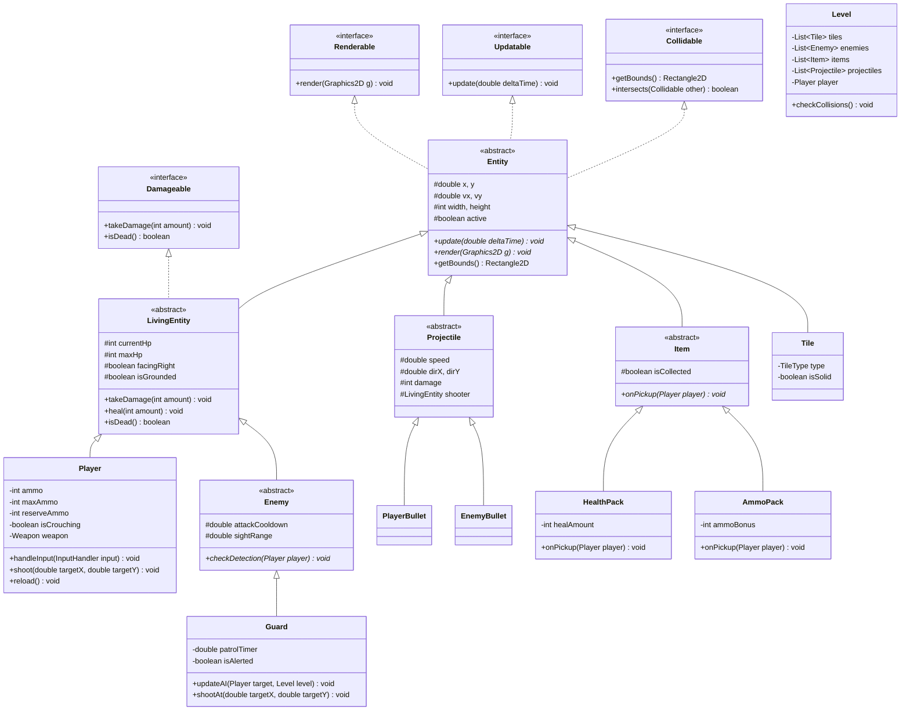

# เอกสารการออกแบบสถาปัตยกรรมระบบ: มาริโอ้เถื่อน (Hardcore Mario)
**วิชา:** Object-Oriented Programming (OOP)  
**ผู้จัดทำ:** ปฏิพล จันทร์บุญ (6804062612102 ตอน 3)  
**ภาษาและเทคโนโลยี:** Java (Java SE / Swing & AWT Graphics2D) — รันได้ทุกเครื่องโดยไม่ต้องลงไลบรารีภายนอกเพิ่ม

---

## 1. บทสรุปเนื้อเรื่องและภาพรวมของเกม (Lore & Concept)
- **เนื้อเรื่อง:** หลังจากจบศึกช่วยเจ้าหญิง มาริโอ้ตื่นขึ้นมาพบว่าความจริงแล้วโลกเห็ดเป็นเพียงแค่ Simulation เพื่อทดสอบอาวุธชีวภาพของ **Apex Syndicate** องค์กรลับใต้ดิน มาริโอ้คือ "หนูทดลองรหัส 6504062636187" เขาจึงต้องจับปืนไรเฟิลจู่โจม แหกศูนย์วิจัย ยิงลุยฝ่ากองกำลัง Guards ในโลกความจริงที่โหดร้าย
- **สไตล์การเล่น:** 2D Side-scrolling Action Platformer สไตล์ **Metal Slug + Mario**
  - กระโดดข้ามสิ่งกีดขวาง/บล็อกแพลตฟอร์ม
  - เดินหน้า-ถอยหลัง หลบวิถีกระสุน
  - ยิงปืนด้วยการเล็งตำแหน่ง Cursor เมาส์อย่างอิสระ 360 องศา

---

## 2. การควบคุม (Controls)
| ปุ่ม / อุปกรณ์ | การกระทำ (Action) |
|---|---|
| **A / D** | เดินซ้าย (ถอยหลัง) / เดินขวา (เดินหน้า) |
| **W** หรือ **Spacebar** | กระโดด (Jump) ขึ้นบนบล็อก/ข้ามสิ่งกีดขวาง |
| **S** | ย่อตัว/หมอบ (Crouch) เพื่อหลบกระสุนและลด Hitbox ตัวละคร |
| **Mouse Cursor** | เล็งทิศทางการยิงของปืนแบบ 360 องศา |
| **Left Click** | ยิงกระสุนปืนไรเฟิลออกไปตามทิศทางเมาส์ |
| **R** | รีโหลดกระสุน (Reload) |
| **Esc / P** | หยุดเกมชั่วคราว (Pause Menu) |

---

## 3. สถาปัตยกรรม OOP (Object-Oriented Programming Structure)
เพื่อให้ได้คะแนนเต็มในวิชา OOP โครงสร้างโปรแกรมถูกออกแบบตามหลักการสำคัญ 4 ประการ:
1. **Encapsulation:** ทุกคลาสใช้ `private` fields พร้อม getter/setter และ encapsulation logic
2. **Inheritance:** การสืบทอดคุณสมบัติที่สมเหตุสมผลผ่านคลาสแม่ `Entity` และ `LivingEntity`
3. **Polymorphism:** การ override เมธอด `update()` และ `render(Graphics2D g)` สำหรับ Object ทุกประเภทใน Loop เดียวกัน
4. **Abstraction:** การใช้ Abstract Classes (`Entity`, `LivingEntity`, `Projectile`, `Item`) และ Interfaces (`Collidable`, `Damageable`, `Updatable`, `Renderable`)



---

## 4. โครงสร้างแพ็กเกจ (Package Layout)
```text
c:\Users\patip\Desktop\hardcore_mario\
├── src\
│   └── com\hardcoremario\
│       ├── Main.java                        (จุดเริ่มต้นของโปรแกรม)
│       ├── core\
│       │   ├── GameEngine.java              (Game Loop 60 FPS, Delta Time)
│       │   ├── GamePanel.java               (Canvas วาดกราฟิกและรับ Event)
│       │   ├── Camera.java                  (กล้องติดตามตัวละคร Smooth Follow)
│       │   ├── InputHandler.java            (ดักจับคีย์บอร์ดและตำแหน่งเมาส์)
│       │   └── SoundManager.java            (ระบบเสียงประกอบและเอฟเฟกต์)
│       ├── model\
│       │   ├── entity\
│       │   │   ├── Entity.java              (Abstract Base Class)
│       │   │   ├── LivingEntity.java        (Abstract มีเลือด มีตาย)
│       │   │   ├── Player.java              (ตัวละคร Mario เถื่อน)
│       │   │   ├── Enemy.java               (Abstract Base ศัตรู)
│       │   │   └── Guard.java               (ศัตรูทหาร Apex Syndicate)
│       │   ├── projectile\
│       │   │   ├── Projectile.java          (Abstract Base กระสุน)
│       │   │   ├── PlayerBullet.java        (กระสุนของมาริโอ้ เล็งตามเมาส์)
│       │   │   └── EnemyBullet.java         (กระสุนของทหารเล็งหาผู้เล่น)
│       │   ├── item\
│       │   │   ├── Item.java                (Abstract Base ไอเทมตกพื้น)
│       │   │   ├── HealthPack.java          (กระเป๋ายาฟื้นฟูเลือด)
│       │   │   └── AmmoPack.java            (กล่องกระสุนรีโหลด)
│       │   └── world\
│       │       ├── Level.java               (ด่าน จัดการ Entity ทั้งหมด)
│       │       ├── Tile.java                (บล็อก อุปสรรค แพลตฟอร์ม)
│       │       └── LevelFactory.java        (โหลดด่านและจัดวางโครงสร้าง)
│       ├── view\
│       │   ├── HUD.java                     (หลอดเลือด กระสุน คะแนน)
│       │   ├── ParticleSystem.java          (ประกายไฟ ปลอกกระสุน เลือดกระเด็น)
│       │   └── SpriteSheetRenderer.java     (เรนเดอร์สไปรต์ตัวละครและบล็อก)
│       └── util\
│           ├── Vector2D.java                (เวกเตอร์คำนวณฟิสิกส์และมุมยิง)
│           └── Constants.java               (ค่าคงที่ต่างๆ เช่น ความเร็ว แรงโน้มถ่วง)
├── assets\                                  (โฟลเดอร์สำหรับรูปภาพและเสียง)
├── compile.bat                              (สคริปต์คอมไพล์โค้ด Java)
└── run.bat                                  (สคริปต์รันเกมคลิกเดียวเล่นได้ทันที)
```

---

## 5. รายละเอียดฟีเจอร์เกม (Core Gameplay & Non-Functional Features)

### 5.1 ฟิสิกส์และการเคลื่อนไหว (Mario Platformer Physics)
- **แรงโน้มถ่วง (Gravity) & การตกพื้น:** ผู้เล่นและศัตรูมีค่าความเร่งโน้มถ่วง เมื่ออยู่บนอากาศจะตกสู่พื้น
- **การกระโดด (Jump):** สามารถกระโดดขึ้นบนบล็อกลอย หรือข้ามสิ่งกีดขวางได้
- **การหมอบ (Crouch):** เมื่อกด `S` ตัวละครจะย่อตัวลง Hitbox ความสูงลดลงครึ่งหนึ่ง สามารถหลบกระสุนในระดับสายตาได้

### 5.2 ระบบการยิงและเล็งด้วยเมาส์ (Metal Slug Style with 360° Mouse Aim)
- คำนวณเวกเตอร์วิถีกระสุน:
  $$\vec{v} = \text{normalize}(\text{mousePos} - \text{playerPos}) \times \text{bulletSpeed}$$
- ผู้เล่นหันหน้าตามทิศทางเมาส์อัตโนมัติ
- มี Muzzle Flash แสงไฟปากกระบอกปืน และ Particle ปลอกกระสุนดีดออก
- ระบบกระสุน: แม็กกาซีนละ 30 นัด มีกระสุนสำรอง สามารถกด `R` รีโหลด หรือเก็บกระสุนจากศัตรู

### 5.3 ศัตรูและการต่อสู้ (AI Guards & Combat)
- **Guards:** ทหารคุมแล็บติดเกราะและปืนไรเฟิล
- เดินลาดตระเวน (Patrol) บนบล็อกหรือพื้น
- เมื่อผู้เล่นเข้ามาในระยะสายตา Guard จะเล็งปืนและยิงใส่ผู้เล่นเป็นจังหวะ
- เมื่อถูกกระสุนโจมตีจนเลือดหมด จะตายและมีโอกาสสุ่ม Drop:
  - **กระเป๋าปฐมพยาบาล (Health Pack)** ฟื้นฟู HP +25
  - **กล่องกระสุน (Ammo Pack)** เติมกระสุน +30 นัด

### 5.4 ด่านและสิ่งแวดล้อม (Dystopian Cyberpunk Lab Level)
- ฉากแนวศูนย์วิจัยชีวภาพ Apex Syndicate (ป้ายไฟนีออน, ท่อสารเคมี, ซากปรักหักพัง, บล็อกเหล็กและคอนกรีต)
- มีบล็อกลอยให้กระโดดไต่ระดับ มีกับดักและสิ่งกีดขวาง
- จุดสิ้นสุดด่าน (Exit / Extraction Pod) เพื่อผ่านด่าน
- หน้าต่างสรุปผลเมื่อจบด่าน / Game Over พร้อมปุ่ม Restart ทันที

---

## 6. แผนการดำเนินงาน (Implementation Steps)
1. **โครงสร้างพื้นฐาน (Core Engine & Input):**
   - สร้าง Window, Game Loop 60 FPS, Keyboard & Mouse Handler, กล้อง Smooth Camera
2. **ระบบฟิสิกส์และตัวละครผู้เล่น (Player & Physics):**
   - ตัวละคร Mario, การเดิน-กระโดด-หมอบ, การตรวจจับการชนบล็อก (AABB Collision)
3. **ระบบการยิงและอาวุธ (Weapons & Projectiles):**
   - คำนวณมุมยิงตามพิกัดเมาส์, กระสุนผู้เล่น, กระสุนศัตรู, ปลอกกระสุนตก
4. **ระบบศัตรูและไอเทม (Enemies & Items):**
   - ทหาร Guard, AI เดินตรวจและยิงโจมตี, กล่องยา, กล่องกระสุน
5. **การสร้างด่านและกราฟิกที่สวยงาม (Level Design & Graphics):**
   - วาด Sprite กราฟิกสไตล์ Retro Cyberpunk Metal Slug ที่ดูดิบเถื่อนแต่สวยงาม มี Particle Effects
6. **HUD และหน้าจอจบเกม (HUD & Game State):**
   - หลอดเลือด, จำนวนกระสุน, หน้าจอ Game Over, หน้าจอ Victory
7. **สคริปต์คอมไพล์และรันเกม (Build Scripts):**
   - จัดทำ `compile.bat` และ `run.bat` ที่ตรวจหา Java อัตโนมัติในเครื่อง ทำให้รันได้ง่ายเพียงดับเบิลคลิก
